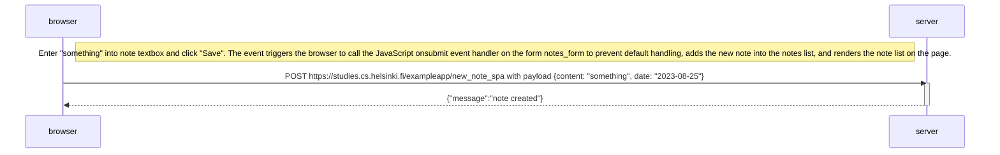

```mermaid
sequenceDiagram
    participant browser
    participant server

    Note right of browser: Enter "something" into note textbox and click "Save". The event triggers the browser to call the JavaScript onsubmit event handler on the form notes_form to prevent default handling, adds the new note into the notes list, and renders the note list on the page.

    browser->>server: POST https://studies.cs.helsinki.fi/exampleapp/new_note_spa with payload {content: "something", date: "2023-08-25"}
    activate server
    server-->>browser: {"message":"note created"}
    deactivate server
```
